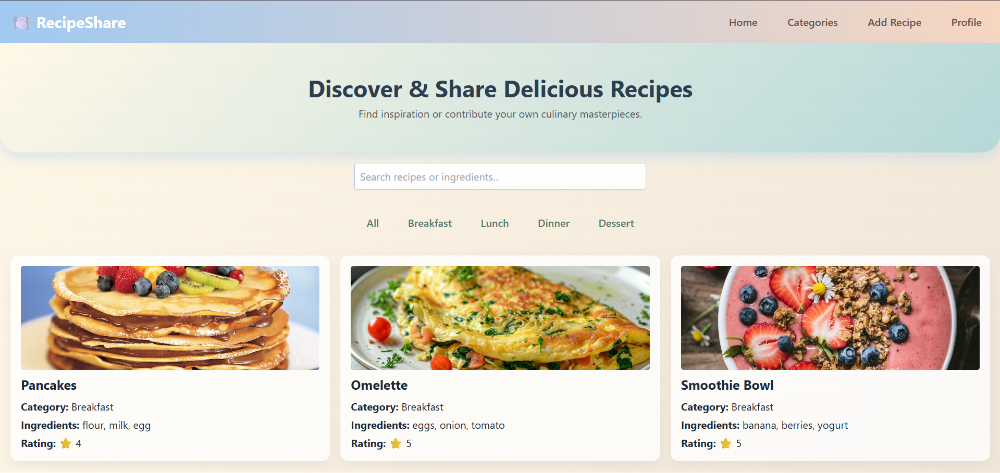
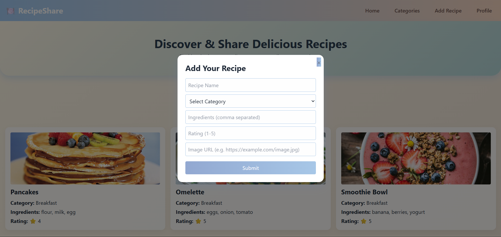
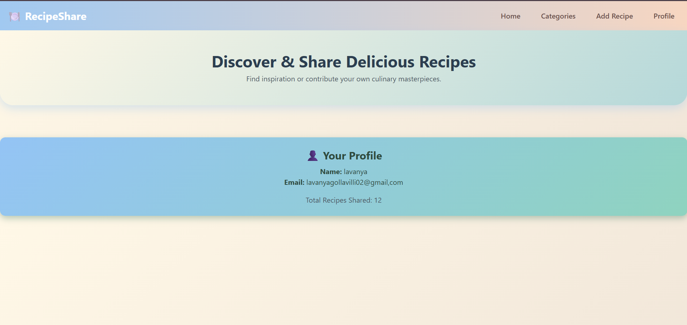

# Recipe Sharing Website
A responsive and visually appealing web application to share, search, filter, and rate recipes. Users can browse recipes by categories, add new recipes with images, and view a profile summary of total recipes shared.

---

## Features
- View recipes displayed in a responsive grid layout.

- Filter recipes by category: Breakfast, Lunch, Dinner, Dessert, or view all.

- Search recipes by name or ingredients in real-time.

- Add new recipes with name, category, ingredients, rating, and image URL.

- View a user profile section showing total recipes shared.

- Smooth animations and modern UI with Tailwind CSS and custom styles.
---
## Technologies Used
- HTML5 for page structure and semantic markup.

- Tailwind CSS for utility-first, responsive styling.

- JavaScript for dynamic interactivity, filtering, searching, and managing recipes.

- CSS gradients and shadows for a soft, warm, and inviting design.

---
## How to Use
1. Open index.html in your web browser.

2. Browse recipes by clicking category buttons or using the search bar.

3. Click Add Recipe in the navbar to open the form and submit new recipes.

4. Click Profile to view your total recipes shared.

5. Use the Home button to return to the main recipe list.
---

## Code Overview
- index.html contains the main page layout including navbar, hero, search, category filters, recipe grid, add recipe popup, and profile section.

- script.js manages:

1. Initial recipe data with images and ratings.

2. Rendering recipes dynamically based on filters/search.

3. Handling add recipe form validation and submission.

4. Toggling profile and main views.
---
## Future Enhancements
- User authentication & personalized profiles.

- Persistent storage via backend or browser local storage.

- Ratings and comments by users.

- Recipe editing and deletion.

- More detailed recipe instructions.
---
## Live Demo
Check out the live project here:

---
## Screenshots
  
*Browse and filter recipes easily.*

  
*Add new recipes with ease.*

  
*View user profile details.*
